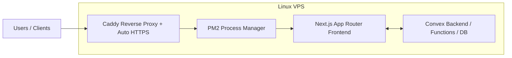

# Scalable E-Commerce Platform (Self-Hosted Architecture)

Production-oriented e-commerce platform engineered end-to-end with **Next.js + Convex**, including storefront, checkout, order pipeline, and role-based manager/admin operations.

> This repository is positioned as a **technical case study**: not just “a website”, but an example of **platform engineering, product ownership, and self-hosted infrastructure**.

---

## 1) Executive Summary

This project demonstrates senior-level ownership across the full lifecycle:
- product architecture and domain modeling;
- backend and frontend implementation;
- operational backoffice tooling;
- production deployment and runtime management.

### Core outcomes
- Built a full commerce flow: catalog → cart → checkout → order lifecycle.
- Implemented role-aware operational console for managers/admins.
- Established self-hosted deployment model with process/runtime control.
- Added reliability and security hardening patterns in critical flows.

---

## 2) Architecture

## High-level system flow



### Components
- **Next.js (App Router):** storefront, checkout UX, manager/admin UI.
- **Convex:** typed backend functions, schema, business logic, queries/mutations.
- **PM2:** production process supervision for the Next.js service.
- **Caddy:** reverse proxy + automatic TLS/HTTPS termination.

---

## 3) Senior Engineering Scope (Technical Case Study)

## Infrastructure & Operations
- **Self-hosted on Linux for 100% data control and cost optimization.**
- **Security hardening via UFW and SSH key management.**
- **Zero-downtime deployment strategy using PM2 and Caddy auto-HTTPS.**

## Platform Engineering
- Domain-driven schema design for commerce and operations.
- Backend workflows for cart integrity, order creation, and admin workflows.
- Search/filter/query paths for catalog and manager dashboards.

## Reliability & Security Patterns
- Server-side validation for checkout/orderability.
- Duplicate order prevention / idempotency strategy in checkout flow.
- Role-aware access boundaries for manager/admin capabilities.
- Blocked-user handling in shared auth helpers.

---

## 4) Managerial / Product Leadership Scope

This project also reflects cross-functional ownership beyond coding:

- **Managed UI/UX design process, hiring and directing external designers to align with system architecture.**
- Translated business requirements into implementation-ready technical backlog.
- Iterated UX and internal ops flows (orders, leads, inventory-related actions).
- Balanced product speed with maintainability and deployment constraints.

---

## 5) Feature Surface

## Customer-facing
- Catalog browsing with categories/brands/filtering.
- Product details and variant/grouped listing behavior.
- Cart lifecycle (guest/session/user scenarios).
- Checkout and order placement.

## Manager/Admin-facing
- Item management (create/update/delete paths).
- Order workflow (status/processing operations).
- Lead and user management workflows.
- Internal search and operational dashboard views.

---

## 6) Repository Structure

- `app/` — Next.js app routes (storefront + manager areas)
- `components/` — reusable UI and feature components
- `convex/` — backend schema/functions (catalog/cart/orders/users/manager/etc.)
- `backend/` — self-hosting assets (Convex docker-compose template)
- `ecosystem.config.js` — PM2 process definition

---

## 7) Tech Stack

- **Language:** TypeScript
- **Frontend:** Next.js, React
- **Backend/Data:** Convex
- **UI:** Radix UI, Tailwind-based utility stack
- **Ops:** PM2, Caddy, Linux VPS
- **Tooling:** Biome, TypeScript checks

---

## 8) Local Development

## Prerequisites
- Bun (or compatible Node runtime setup)
- Convex CLI configured
- `.env.local` configured for your environment

## Run locally

```bash
bun install
bun run dev
```

This starts frontend + backend dev processes.

## Quality checks

```bash
bun run lint
bun run typecheck
```

---

## 9) Deployment Notes (Self-Hosted)

Current production-style setup uses:
- Next.js app process managed with PM2 (`ecosystem.config.js`)
- Caddy reverse proxy + HTTPS
- Convex backend in self-hosted mode (see `backend/docker-compose.yml.convex`)

Suggested production checklist:
- enforce env validation for critical secrets/URLs;
- lock down exposed debug/test surfaces;
- maintain backup + rollback procedure;
- add monitoring/alerting and smoke checks after deploy.

---

## 10) ACH-Style Impact Bullets (for CV / interviews)

Use these as a baseline and adapt with your real metrics:

1. **Architected** and shipped a production e-commerce platform using Next.js + Convex, **enabling** end-to-end ownership from storefront to operations.
2. **Designed** multi-entity commerce schema and backend workflows, **improving** consistency across catalog, cart, and order lifecycles.
3. **Implemented** role-based manager/admin tooling, **reducing** operational friction for order/lead/user management.
4. **Hardened** checkout pipeline with server-side validation and idempotency protections, **preventing** duplicate/invalid order scenarios.
5. **Established** self-hosted runtime with PM2 + Caddy, **improving** deployment control, reliability, and infrastructure cost efficiency.
6. **Led** cross-functional UI/UX execution with external designers, **aligning** interface quality with technical architecture and delivery timelines.

---

## 11) Why this project is a Senior-level portfolio artifact

Because it demonstrates:
- technical depth (architecture + backend + frontend);
- operational maturity (deployment/runtime/security);
- product delivery ownership (from zero to production);
- leadership behavior (cross-functional coordination and execution).

---

## Contact / Discussion

If you want a walkthrough, I can share a structured review covering:
1. architecture decisions,
2. trade-offs,
3. production constraints,
4. future scaling roadmap.
