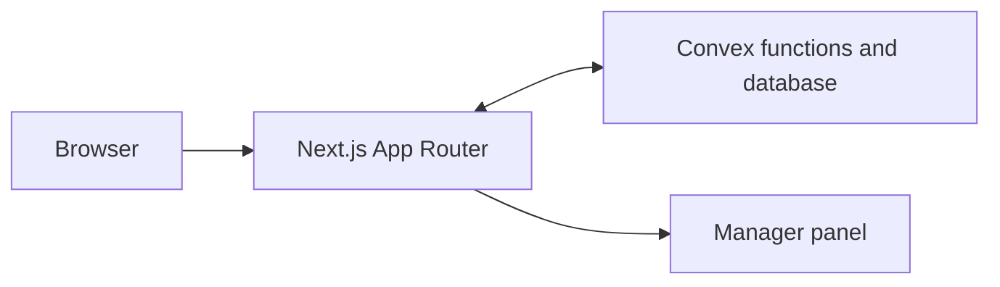

# Klimat22 heating equipment store

A commissioned e-commerce project for a heating equipment store. I was the
only developer. A designer was involved separately.

**Project activity:** September 2025 to March 2026

**Current status:** Klimat22 is currently unavailable and has no live demo.

## What I built

- Product catalog with categories, brands, filters, search, variants, and
  grouped items.
- Catalog browsing, guest cart, checkout, and order creation.
- Customer requests.
- Manager panel for catalog items, orders, leads, users, categories, and
  brands.
- Convex schema and backend functions for the commerce domain.
- Role checks for users, managers, and admins.
- Server-side input validation and cart/order ownership checks.
- Order item snapshots and protection against creating the same order twice
  from one cart.
- Data migration using a Convex export, local transformation, and import.

Online payments are not integrated. The checkout stores a payment method and
status, but it does not process card payments.

## Architecture

```mermaid
flowchart LR
    B[Browser] --> N[Next.js App Router]
    N <--> C[Convex functions and database]
    N --> M[Manager panel]
```

- **Frontend:** Next.js App Router, React, TypeScript.
- **Backend and data:** Convex functions, schema, queries, and mutations.
- **UI:** Radix UI components and Tailwind CSS utilities.
- **Operations:** A historical frontend/backend deployment used PM2 and a
  Linux VPS. The self-hosting configuration is incomplete and a fresh run has
  not been verified.
- **Tooling:** pnpm, Biome, and TypeScript.

## Local setup

The repository expects Node.js, pnpm, the Convex CLI, and environment
configuration such as `.env.local`. Existing scripts cover development,
Biome checks, TypeScript checks, and builds. A fresh install and run have not
been verified. Automated tests are not available yet.

## Scope and limitations

- Cart merging after sign-in is unfinished.
- The self-hosting files are configuration notes, not a verified deployment
  recipe.

## Repository areas

- `app/`: storefront, checkout, order pages, and manager routes
- `components/`: shared UI and feature components
- `convex/`: schema, queries, mutations, auth helpers, and migrations
- `backend/`: self-hosting configuration template
- `ecosystem.config.js`: PM2 process definition
